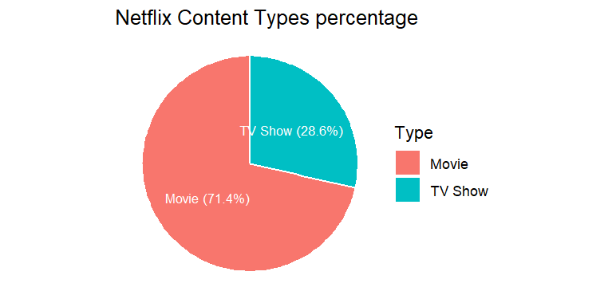
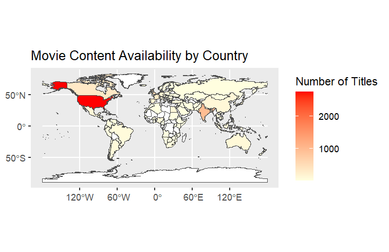
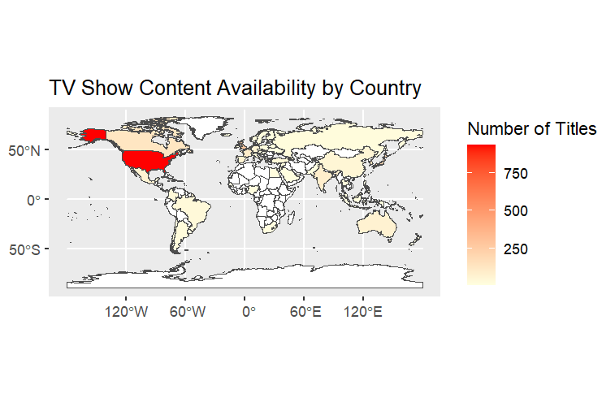
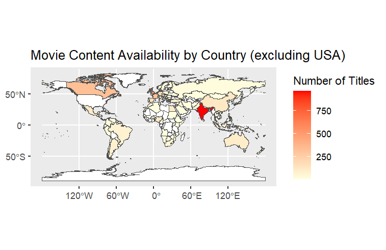
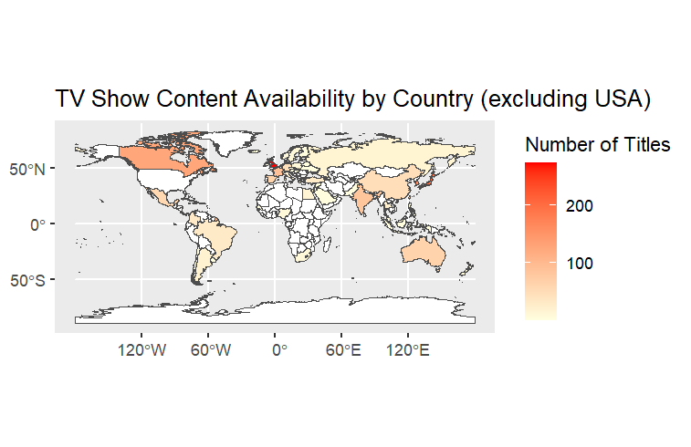
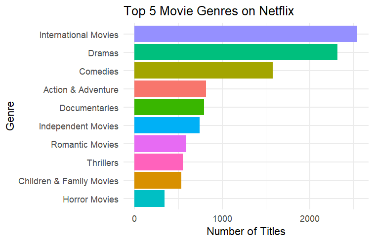
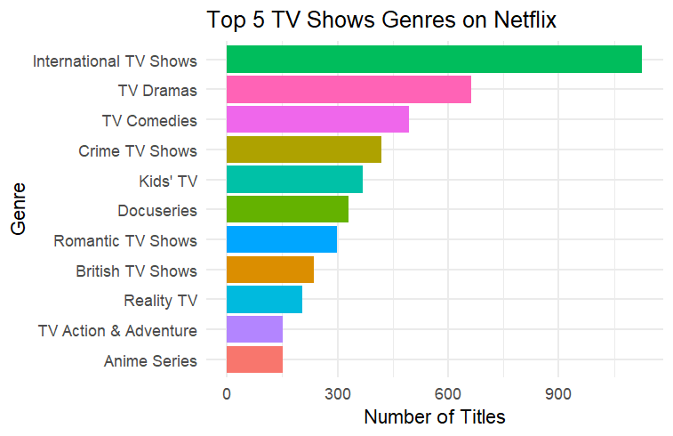
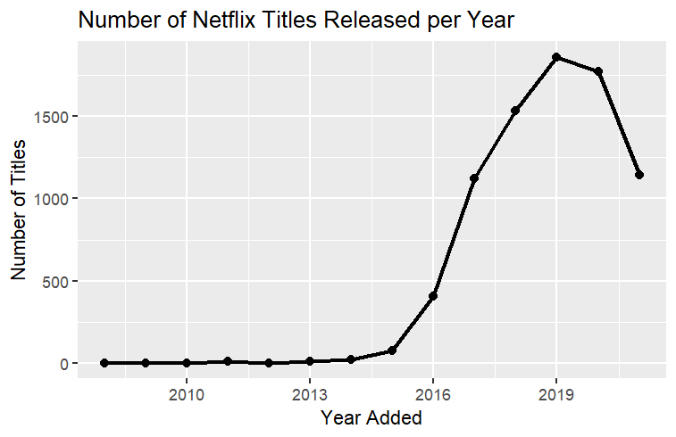

### Key questions: 

 * Which types of content should Netflix prioritize to maximize subscriber engagement? 

* Which countries contribute the most content to Netflix's catalog, and where 
might opportunities for regional expansion exist?

### Business Task: 
Analyze trends in Netflix’s content catalog to identify opportunities for 
content expansion, diversification, and strategic investment to improve overall subscriber engagement.

### Data preparation
Initially, packages need to be installed for cleaning and visualizing the data.
``` {r Install and load packages, eval = FALSE}
install.packages("tidyverse", repos = "https://cloud.r-project.org/")
install.packages(c("sf", "rnaturalearth", "rnaturalearthdata"), repos = "https://cloud.r-project.org/")

library(tidyverse)
library(lubridate)
library(sf)
library(rnaturalearth)
library(rnaturalearthdata)
```

The data has been extracted from Kaggle, https://www.kaggle.com/datasets/shivamb/netflix-shows/data. The data does comply with the ROCC framework. The data is reliable because the dataset has been uploaded from a reputable director and customer data science at H2O.ai. 
``` {r}
data <- read.csv("./data/netflix_titles.csv", na.strings = c("", "NA", "N/A"))
```

The dataset has also been tested for duplicates, for which there is none, and whether there are null values, for which there are some but the missing values provide an insight. For example, it is not possible to know every single director for all the movies and tv shows on Netflix, perhaps because Netflix did not want to reveal them or they are just unknown. Overall, the dataset seems to have gone through some pre-processing and so it is reliable. 

Whether the dataset is original is uncertain. The collection method for the data is through regular API calls, which means it was gathered automatically by querying an official API at set intervals. There is a CC0 (Creative Commons Zero) license which means that the author waives all rights to this dataset, and so it can be used for any purpose, including commercial. 

Whether the data is comprehensive is also uncertain.
The data may not be current, however, it can still answer the question for how to retain current customers by focusing on what Netflix could invest more in.

### Tools used
The tool will be R. This is because the dataset is too big for a spreadsheet, and SQL is also not suitable because it cannot produce graphs directly.

### Data pre-processing
Pre-processing steps have been taken.
``` {r Pre-processing, eval = FALSE}
data <- data %>%
  mutate(
    director = replace_na(director, "Unknown"),
    cast = replace_na(cast, "Unknown")
    )

df <- data %>% drop_na(-director, -cast)

df <- df %>%
  mutate(date_added = mdy(date_added), year_added = year(date_added))
```

The data did contain some nulls, specifically in the director, cast, country, date_added, rating, duration. The data has been mutated for the director and cast fields to have the value “Unknown”.  All null records have been removed, except for director and cast, because it is generally normal to not have values in those fields for certain movies, either because Netflix did not want to reveal them, or the platform just did not find out.  

After these steps, the data is clean because the business task only requires finding insights on how to retain the current customer base and expand their services to other countries to gain new customers. 

### Analysis
The first to look at is the spread of content types in Netflix. Netflix is a 
platform streaming service, and its contents are mainly movies and TV shows.



We can see that Netflix has more movies than TV shows in its library. This could
be an indication that either people prefer to watch movies casually once a week
for example, or that what is available out there is mostly movies. Potentially,
Netflix can focus on making more TV shows available and invest in upcoming TV 
shows to expand its library and attract new audiences.




Comparing the two types, we can see that the US contributes the most movies and
TV shows. Although Netflix is available in most countries, because only the US 
contributes to most content, it may not be inclusive for all nations around the 
world. What this means is that the content may not capture a large part of the audience because the audience does not feel a sort of personal connection to the content. Viewers respond strongly to culturally relevant content. So, Netflix 
could focus on investing on other countries/companies who are trying to make movies or TV shows. 




From these distributions, which exclude the US, we can see that there is a lot of content from India, possibly Bollywood movies. As for TV content, we can see that the United Kingdom has produced more, possibly BBC documentaries.

#### Top Genres




From these plots, we can see that international, dramas and comedies are the top
3. The data may seem contradictory at because at first glance, one would think that the US produces the most content and therefore there cannot be anything more outside of it, but actually, since any content outside is most likely labelled as International, there a bigger majority when compared to the US.

### Netflix's released title by year


* This plot shows Netflix's release year for each year. We can see that during the 2010 period, not much content has been released, perhaps because streaming services like Netflix were not popular. 

* 2013 onward, Netflix started to become more appealing to the public and so more titles were being released. Older movies were also added in the library.

* The drop shown from 2019 is just an under-representation of the data because Netflix does update its library often. But, given the data collection of the data, which was discontinued after 2021, it is not the original representation.

## Conclusion
While the dataset does not include engagement or viewership metrics, we can observe that Netflix has added more movies than TV shows overall. Among genres, international titles, dramas, and comedies appear most frequently. Based on these trends, Netflix may continue to prioritize these content types when expanding its catalog.

In terms of production, the United States contributes the largest number of titles, likely due to its larger entertainment industry and production budgets. Other countries are underrepresented in Netflix’s catalog. Investing in local productions in underrepresented regions could help Netflix diversify its content and better connect with audiences culturally, potentially enhancing its global reach and appeal
